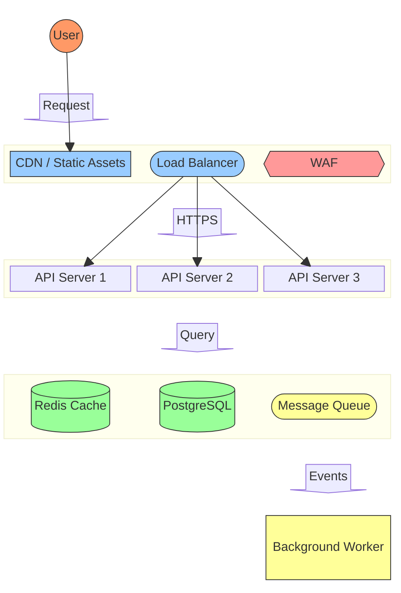

# Block Diagram: Cloud Application Architecture

```mermaid
block-beta
    columns 3

    User(("User")) space:2

    down1<["Request"]>(down) space:2

    block:frontend:3
        columns 3
        CDN["CDN / Static Assets"] LB(["Load Balancer"]) WAF{{"WAF"}}
    end

    space down2<["HTTPS"]>(down) space

    block:backend:3
        columns 3
        API1["API Server 1"] API2["API Server 2"] API3["API Server 3"]
    end

    space down3<["Query"]>(down) space

    block:data:3
        columns 3
        Cache[("Redis Cache")] DB[("PostgreSQL")] Queue(["Message Queue"])
    end

    space:2 down4<["Events"]>(down)

    space:2 Worker["Background Worker"]

    User --> CDN
    LB --> API1
    LB --> API2
    LB --> API3

    style User fill:#f96,stroke:#333
    style CDN fill:#9cf,stroke:#333
    style LB fill:#9cf,stroke:#333
    style WAF fill:#f99,stroke:#333
    style Cache fill:#9f9,stroke:#333
    style DB fill:#9f9,stroke:#333
    style Queue fill:#ff9,stroke:#333
    style Worker fill:#ff9,stroke:#333
```
