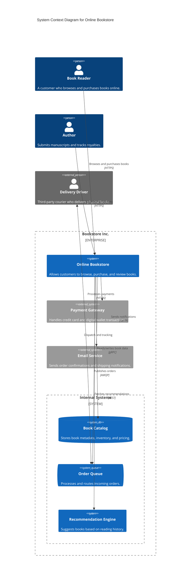

# C4 Diagram: Online Bookstore System Context

```mermaid
C4Context
    title System Context Diagram for Online Bookstore

    Person(reader, "Book Reader", "A customer who browses and purchases books online.")
    Person(author, "Author", "Submits manuscripts and tracks royalties.")
    Person_Ext(delivery, "Delivery Driver", "Third-party courier who delivers physical books.")

    Enterprise_Boundary(b0, "Bookstore Inc.") {
        System(bookstore, "Online Bookstore", "Allows customers to browse, purchase, and review books.")

        System_Boundary(b1, "Internal Systems") {
            SystemDb(catalog, "Book Catalog", "Stores book metadata, inventory, and pricing.")
            SystemQueue(orders, "Order Queue", "Processes and routes incoming orders.")
            System(recs, "Recommendation Engine", "Suggests books based on reading history.")
        }

        System_Ext(payment, "Payment Gateway", "Handles credit card and digital wallet transactions.")
        System_Ext(email, "Email Service", "Sends order confirmations and shipping notifications.")
    }

    Rel(reader, bookstore, "Browses and purchases books", "HTTPS")
    Rel(author, bookstore, "Submits manuscripts", "HTTPS")
    Rel(bookstore, catalog, "Reads/writes book data", "gRPC")
    Rel(bookstore, orders, "Publishes orders", "AMQP")
    Rel(bookstore, recs, "Fetches recommendations", "REST")
    Rel(bookstore, payment, "Processes payments", "HTTPS")
    Rel(bookstore, email, "Sends notifications", "SMTP")
    BiRel(orders, delivery, "Dispatch and tracking")

    UpdateRelStyle(reader, bookstore, $offsetY="-40")
    UpdateRelStyle(bookstore, payment, $offsetX="-60", $offsetY="20")
    UpdateRelStyle(bookstore, email, $offsetX="60", $offsetY="20")

    UpdateLayoutConfig($c4ShapeInRow="3", $c4BoundaryInRow="1")
```
