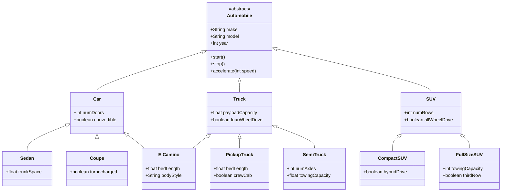

# Class Diagram: Automobile Hierarchy

```mermaid
classDiagram
    class Automobile {
        <<abstract>>
        +String make
        +String model
        +int year
        +start()
        +stop()
        +accelerate(int speed)
    }

    class Car {
        +int numDoors
        +boolean convertible
    }

    class Truck {
        +float payloadCapacity
        +boolean fourWheelDrive
    }

    class SUV {
        +int numRows
        +boolean allWheelDrive
    }

    class Sedan {
        +float trunkSpace
    }

    class Coupe {
        +boolean turbocharged
    }

    class PickupTruck {
        +float bedLength
        +boolean crewCab
    }

    class SemiTruck {
        +int numAxles
        +float towingCapacity
    }

    class CompactSUV {
        +boolean hybridDrive
    }

    class FullSizeSUV {
        +int towingCapacity
        +boolean thirdRow
    }

    class ElCamino {
        +float bedLength
        +String bodyStyle
    }

    Automobile <|-- Car
    Automobile <|-- Truck
    Automobile <|-- SUV

    Car <|-- Sedan
    Car <|-- Coupe
    Car <|-- ElCamino

    Truck <|-- PickupTruck
    Truck <|-- SemiTruck
    Truck <|-- ElCamino

    SUV <|-- CompactSUV
    SUV <|-- FullSizeSUV
```
