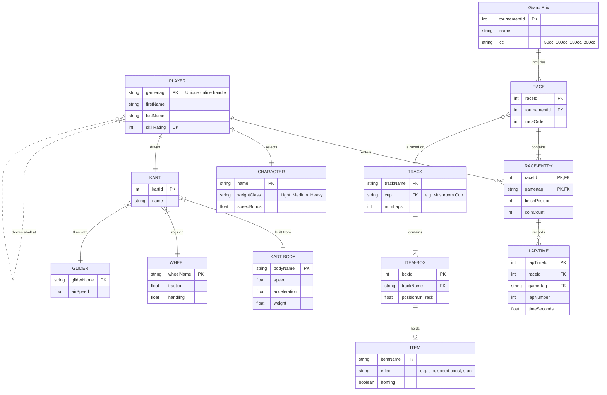

# Entity Relationship Diagram: Mario Kart Tournament

```mermaid
erDiagram
    PLAYER ||--o{ RACE-ENTRY : "enters"
    RACE ||--|{ RACE-ENTRY : contains
    RACE }o--|| TRACK : "is raced on"
    PLAYER ||--|| CHARACTER : selects
    PLAYER ||--|| KART : drives
    KART }|--|| KART-BODY : "built from"
    KART }|--|| WHEEL : "rolls on"
    KART }|--|| GLIDER : "flies with"
    RACE-ENTRY ||--o{ LAP-TIME : records
    TRACK ||--|{ ITEM-BOX : contains
    ITEM-BOX ||--o| ITEM : holds
    PLAYER }|..o{ PLAYER : "throws shell at"
    TOURNAMENT ||--|{ RACE : includes

    PLAYER {
        string gamertag PK "Unique online handle"
        string firstName
        string lastName
        int skillRating UK
    }

    CHARACTER {
        string name PK
        string weightClass "Light, Medium, Heavy"
        float speedBonus
    }

    KART {
        int kartId PK
        string name
    }

    KART-BODY {
        string bodyName PK
        float speed
        float acceleration
        float weight
    }

    WHEEL {
        string wheelName PK
        float traction
        float handling
    }

    GLIDER {
        string gliderName PK
        float airSpeed
    }

    TOURNAMENT["Grand Prix"] {
        int tournamentId PK
        string name
        string cc "50cc, 100cc, 150cc, 200cc"
    }

    RACE {
        int raceId PK
        int tournamentId FK
        int raceOrder
    }

    TRACK {
        string trackName PK
        string cup FK "e.g. Mushroom Cup"
        int numLaps
    }

    RACE-ENTRY {
        int raceId PK, FK
        string gamertag PK, FK
        int finishPosition
        int coinCount
    }

    LAP-TIME {
        int lapTimeId PK
        int raceId FK
        string gamertag FK
        int lapNumber
        float timeSeconds
    }

    ITEM-BOX {
        int boxId PK
        string trackName FK
        float positionOnTrack
    }

    ITEM {
        string itemName PK
        string effect "e.g. slip, speed boost, stun"
        boolean homing
    }
```
