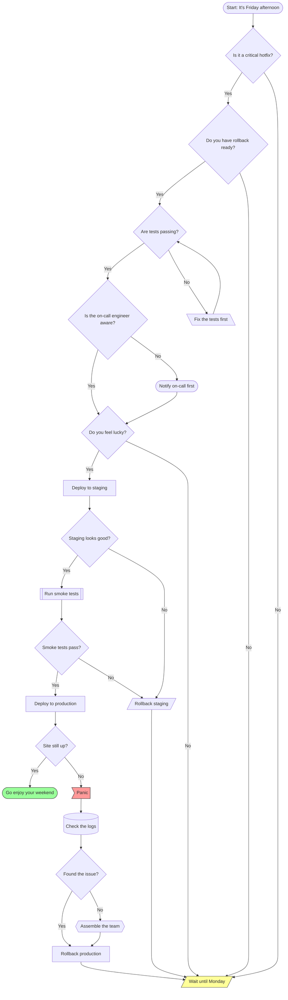

# Flowchart: Should I Deploy on Friday?

```mermaid
flowchart TD
    A([Start: It's Friday afternoon]) --> B{Is it a critical hotfix?}
    B -->|Yes| C{Do you have rollback ready?}
    B -->|No| D[/Wait until Monday/]
    C -->|Yes| E{Are tests passing?}
    C -->|No| D
    E -->|Yes| F{Is the on-call engineer aware?}
    E -->|No| G[\Fix the tests first\]
    G --> E
    F -->|Yes| H{Do you feel lucky?}
    F -->|No| I([Notify on-call first])
    I --> H
    H -->|Yes| J[Deploy to staging]
    H -->|No| D

    J --> K{Staging looks good?}
    K -->|Yes| L[[Run smoke tests]]
    K -->|No| M[/Rollback staging/]
    M --> D
    L --> N{Smoke tests pass?}
    N -->|Yes| O[Deploy to production]
    N -->|No| M

    O --> P{Site still up?}
    P -->|Yes| Q([Go enjoy your weekend])
    P -->|No| R>Panic]
    R --> S[(Check the logs)]
    S --> T{Found the issue?}
    T -->|Yes| U[Rollback production]
    T -->|No| V{{Assemble the team}}
    V --> U
    U --> D

    style Q fill:#9f9,stroke:#333
    style R fill:#f99,stroke:#333
    style D fill:#ff9,stroke:#333
```
