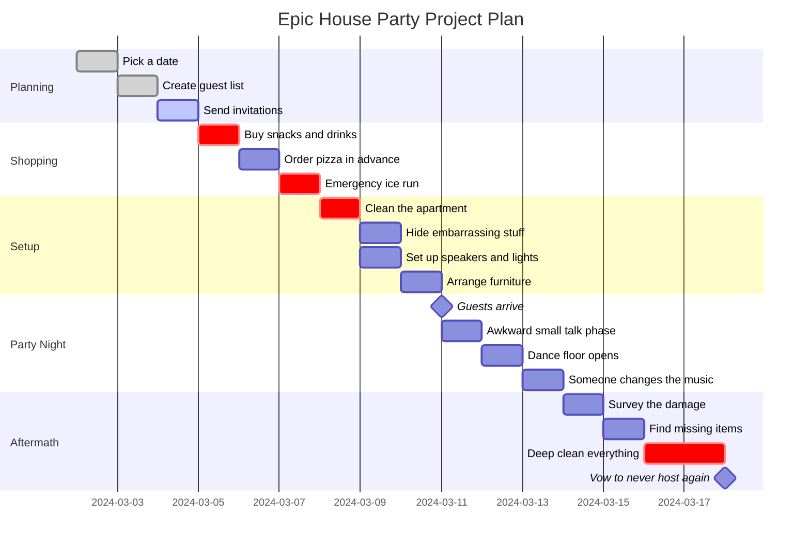

# Gantt Chart: Planning a House Party

```mermaid
gantt
    title Epic House Party Project Plan
    dateFormat YYYY-MM-DD
    excludes weekdays

    section Planning
        Pick a date                 :done, plan1, 2024-03-02, 1d
        Create guest list           :done, plan2, after plan1, 1d
        Send invitations            :active, plan3, after plan2, 1d

    section Shopping
        Buy snacks and drinks       :crit, shop1, after plan3, 1d
        Order pizza in advance      :shop2, after shop1, 1d
        Emergency ice run           :crit, shop3, after shop2, 1d

    section Setup
        Clean the apartment         :crit, setup1, after shop3, 1d
        Hide embarrassing stuff     :setup2, after setup1, 1d
        Set up speakers and lights  :setup3, after setup1, 1d
        Arrange furniture           :setup4, after setup2, 1d

    section Party Night
        Guests arrive               :milestone, party1, after setup4, 0d
        Awkward small talk phase     :party2, after party1, 1d
        Dance floor opens           :party3, after party2, 1d
        Someone changes the music   :party4, after party3, 1d

    section Aftermath
        Survey the damage           :after1, after party4, 1d
        Find missing items          :after2, after after1, 1d
        Deep clean everything       :crit, after3, after after2, 2d
        Vow to never host again     :milestone, after4, after after3, 0d
```
