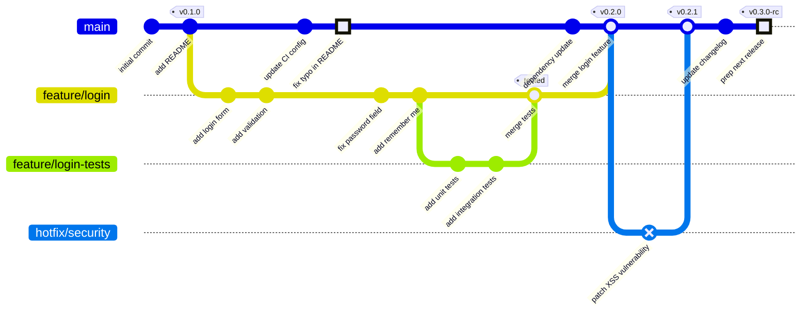

# Gitgraph: The Typical Feature Branch Saga

```mermaid
gitGraph
    commit id: "initial commit"
    commit id: "add README" tag: "v0.1.0"

    branch feature/login
    checkout feature/login
    commit id: "add login form"
    commit id: "add validation"

    checkout main
    commit id: "update CI config"
    commit id: "fix typo in README" type: HIGHLIGHT

    checkout feature/login
    commit id: "fix password field"
    commit id: "add remember me"

    branch feature/login-tests
    checkout feature/login-tests
    commit id: "add unit tests"
    commit id: "add integration tests"

    checkout feature/login
    merge feature/login-tests id: "merge tests" tag: "tested"

    checkout main
    commit id: "dependency update"
    merge feature/login id: "merge login feature" tag: "v0.2.0"

    branch hotfix/security
    checkout hotfix/security
    commit id: "patch XSS vulnerability" type: REVERSE

    checkout main
    merge hotfix/security tag: "v0.2.1"
    commit id: "update changelog"
    commit id: "prep next release" type: HIGHLIGHT tag: "v0.3.0-rc"
```
