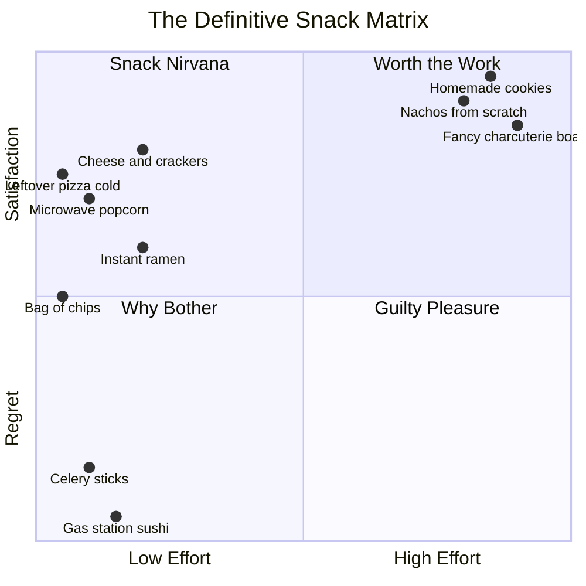

# Quadrant Chart: Snack Decision Matrix

```mermaid
quadrantChart
    title The Definitive Snack Matrix
    x-axis Low Effort --> High Effort
    y-axis Regret --> Satisfaction
    quadrant-1 Worth the Work
    quadrant-2 Snack Nirvana
    quadrant-3 Why Bother
    quadrant-4 Guilty Pleasure
    Nachos from scratch: [0.8, 0.9]
    Homemade cookies: [0.85, 0.95]
    Microwave popcorn: [0.1, 0.7]
    Cheese and crackers: [0.2, 0.8]
    Gas station sushi: [0.15, 0.05]
    Celery sticks: [0.1, 0.15]
    Leftover pizza cold: [0.05, 0.75]
    Fancy charcuterie board: [0.9, 0.85]
    Bag of chips: [0.05, 0.5]
    Instant ramen: [0.2, 0.6]
```
