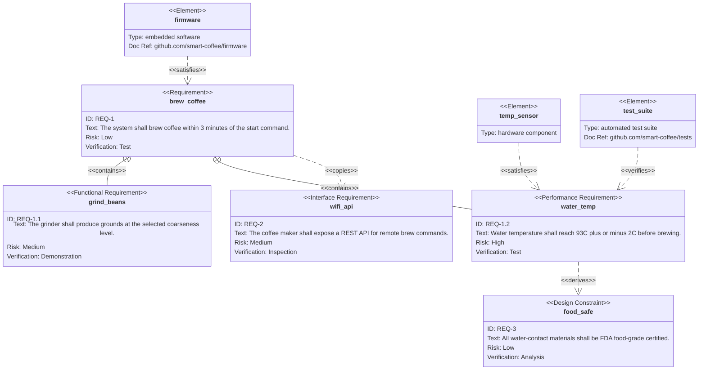

# Requirement Diagram: Smart Coffee Maker

```mermaid
requirementDiagram

    requirement brew_coffee {
    id: "REQ-1"
    text: "The system shall brew coffee within 3 minutes of the start command."
    risk: low
    verifymethod: test
    }

    functionalRequirement grind_beans {
    id: "REQ-1.1"
    text: "The grinder shall produce grounds at the selected coarseness level."
    risk: medium
    verifymethod: demonstration
    }

    performanceRequirement water_temp {
    id: "REQ-1.2"
    text: "Water temperature shall reach 93C plus or minus 2C before brewing."
    risk: high
    verifymethod: test
    }

    interfaceRequirement wifi_api {
    id: "REQ-2"
    text: "The coffee maker shall expose a REST API for remote brew commands."
    risk: medium
    verifymethod: inspection
    }

    designConstraint food_safe {
    id: "REQ-3"
    text: "All water-contact materials shall be FDA food-grade certified."
    risk: low
    verifymethod: analysis
    }

    element firmware {
    type: "embedded software"
    docref: "github.com/smart-coffee/firmware"
    }

    element temp_sensor {
    type: "hardware component"
    }

    element test_suite {
    type: "automated test suite"
    docref: "github.com/smart-coffee/tests"
    }

    brew_coffee - contains -> grind_beans
    brew_coffee - contains -> water_temp
    brew_coffee - traces -> wifi_api
    water_temp - derives -> food_safe
    firmware - satisfies -> brew_coffee
    temp_sensor - satisfies -> water_temp
    test_suite - verifies -> water_temp
    wifi_api <- copies - brew_coffee
```
