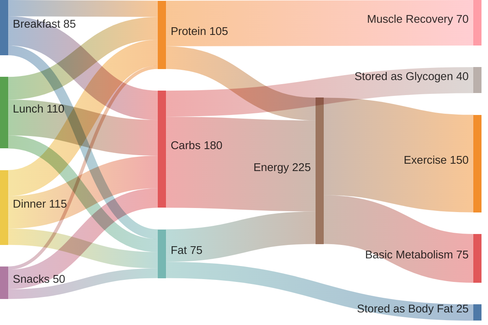

# Sankey Diagram: Daily Calorie Flow

```mermaid
sankey-beta

Breakfast,Protein,25
Breakfast,Carbs,45
Breakfast,Fat,15
Lunch,Protein,35
Lunch,Carbs,55
Lunch,Fat,20
Dinner,Protein,40
Dinner,Carbs,50
Dinner,Fat,25
Snacks,Carbs,30
Snacks,Fat,15
Snacks,Protein,5

Protein,Muscle Recovery,70
Protein,Energy,35
Carbs,Energy,140
Carbs,Stored as Glycogen,40
Fat,Energy,50
Fat,Stored as Body Fat,25
Energy,Exercise,150
Energy,Basic Metabolism,75
```
