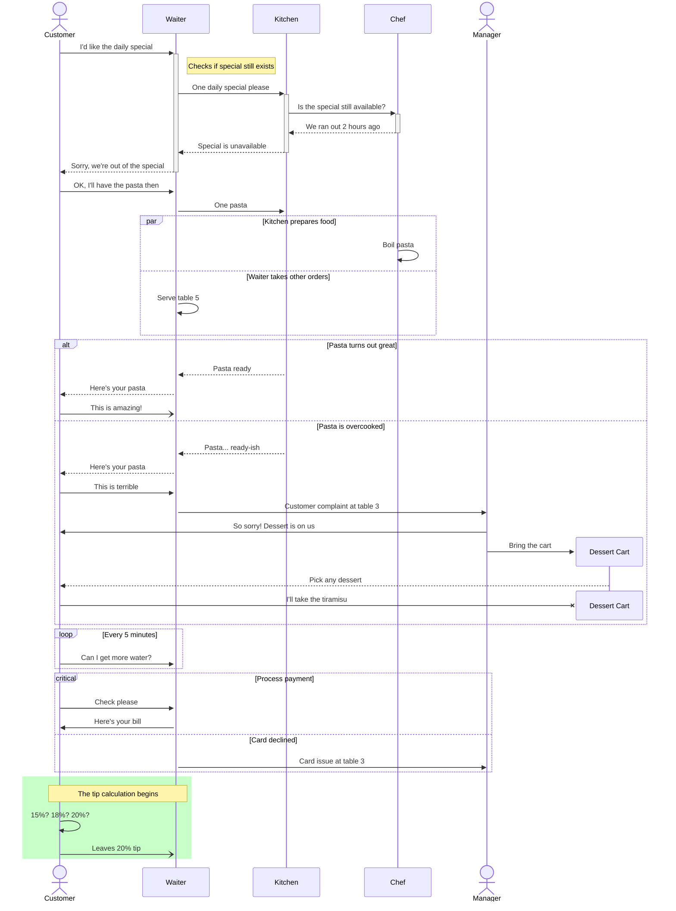

# Sequence Diagram: Ordering at a Confusing Restaurant

```mermaid
sequenceDiagram
    actor Customer
    participant Waiter
    participant Kitchen
    participant Chef
    actor Manager

    Customer->>+Waiter: I'd like the daily special
    Note right of Waiter: Checks if special still exists
    Waiter->>+Kitchen: One daily special please
    Kitchen->>+Chef: Is the special still available?
    Chef-->>-Kitchen: We ran out 2 hours ago

    Kitchen-->>-Waiter: Special is unavailable
    Waiter-->>-Customer: Sorry, we're out of the special

    Customer->>+Waiter: OK, I'll have the pasta then
    Waiter->>+Kitchen: One pasta

    par Kitchen prepares food
        Chef->>Chef: Boil pasta
    and Waiter takes other orders
        Waiter->>Waiter: Serve table 5
    end

    alt Pasta turns out great
        Kitchen-->>Waiter: Pasta ready
        Waiter-->>Customer: Here's your pasta
        Customer-)Waiter: This is amazing!
    else Pasta is overcooked
        Kitchen-->>Waiter: Pasta... ready-ish
        Waiter-->>Customer: Here's your pasta
        Customer->>Waiter: This is terrible
        Waiter->>Manager: Customer complaint at table 3
        Manager->>Customer: So sorry! Dessert is on us

        create participant Dessert Cart
        Manager->>Dessert Cart: Bring the cart
        Dessert Cart-->>Customer: Pick any dessert
        destroy Dessert Cart
        Customer-xDessert Cart: I'll take the tiramisu
    end

    loop Every 5 minutes
        Customer->>Waiter: Can I get more water?
    end

    critical Process payment
        Customer->>Waiter: Check please
        Waiter->>Customer: Here's your bill
    option Card declined
        Waiter->>Manager: Card issue at table 3
    end

    rect rgb(200, 255, 200)
        Note over Customer,Waiter: The tip calculation begins
        Customer->>Customer: 15%? 18%? 20%?
        Customer-)Waiter: Leaves 20% tip
    end
```
