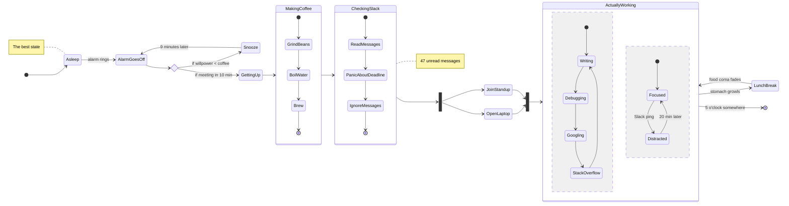

# State Diagram: Developer's Monday Morning

```mermaid
stateDiagram-v2
    direction LR

    [*] --> Asleep
    Asleep --> AlarmGoesOff : alarm rings

    state AlarmDecision <<choice>>
    AlarmGoesOff --> AlarmDecision
    AlarmDecision --> Snooze : if willpower < coffee
    AlarmDecision --> GettingUp : if meeting in 10 min

    Snooze --> AlarmGoesOff : 9 minutes later
    GettingUp --> MakingCoffee

    state MakingCoffee {
        [*] --> GrindBeans
        GrindBeans --> BoilWater
        BoilWater --> Brew
        Brew --> [*]
    }

    MakingCoffee --> CheckingSlack
    note right of CheckingSlack : 47 unread messages

    state CheckingSlack {
        [*] --> ReadMessages
        ReadMessages --> PanicAboutDeadline
        PanicAboutDeadline --> IgnoreMessages
        IgnoreMessages --> [*]
    }

    state fork_standup <<fork>>
    CheckingSlack --> fork_standup
    fork_standup --> OpenLaptop
    fork_standup --> JoinStandup

    state join_standup <<join>>
    OpenLaptop --> join_standup
    JoinStandup --> join_standup
    join_standup --> ActuallyWorking

    state ActuallyWorking {
        [*] --> Writing
        Writing --> Debugging
        Debugging --> Googling
        Googling --> StackOverflow
        StackOverflow --> Writing
        --
        [*] --> Focused
        Focused --> Distracted : Slack ping
        Distracted --> Focused : 20 min later
    }

    ActuallyWorking --> LunchBreak : stomach growls
    LunchBreak --> ActuallyWorking : food coma fades
    ActuallyWorking --> [*] : 5 o'clock somewhere

    note left of Asleep : The best state
```
