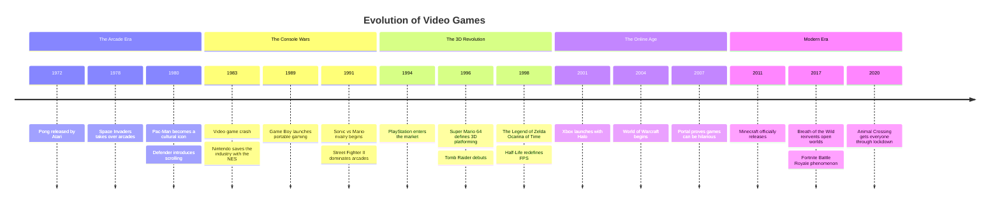

# Timeline: History of Video Games

```mermaid
timeline
    title Evolution of Video Games
    section The Arcade Era
        1972 : Pong released by Atari
        1978 : Space Invaders takes over arcades
        1980 : Pac-Man becomes a cultural icon
             : Defender introduces scrolling
    section The Console Wars
        1983 : Video game crash
             : Nintendo saves the industry with the NES
        1989 : Game Boy launches portable gaming
        1991 : Sonic vs Mario rivalry begins
             : Street Fighter II dominates arcades
    section The 3D Revolution
        1994 : PlayStation enters the market
        1996 : Super Mario 64 defines 3D platforming
             : Tomb Raider debuts
        1998 : The Legend of Zelda Ocarina of Time
             : Half-Life redefines FPS
    section The Online Age
        2001 : Xbox launches with Halo
        2004 : World of Warcraft begins
        2007 : Portal proves games can be hilarious
    section Modern Era
        2011 : Minecraft officially releases
        2017 : Breath of the Wild reinvents open worlds
             : Fortnite Battle Royale phenomenon
        2020 : Animal Crossing gets everyone through lockdown
```
