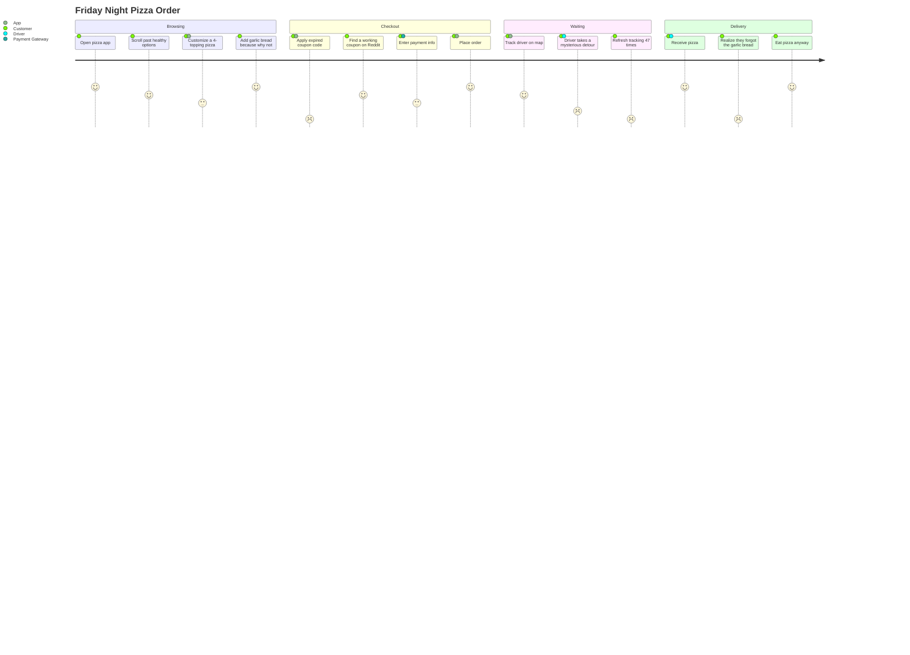

# User Journey: Ordering Pizza Online

```mermaid
journey
    title Friday Night Pizza Order
    section Browsing
        Open pizza app: 5: Customer
        Scroll past healthy options: 4: Customer
        Customize a 4-topping pizza: 3: Customer, App
        Add garlic bread because why not: 5: Customer
    section Checkout
        Apply expired coupon code: 1: Customer, App
        Find a working coupon on Reddit: 4: Customer
        Enter payment info: 3: Customer, Payment Gateway
        Place order: 5: Customer, App
    section Waiting
        Track driver on map: 4: Customer, App
        Driver takes a mysterious detour: 2: Customer, Driver
        Refresh tracking 47 times: 1: Customer
    section Delivery
        Receive pizza: 5: Customer, Driver
        Realize they forgot the garlic bread: 1: Customer
        Eat pizza anyway: 5: Customer
```
