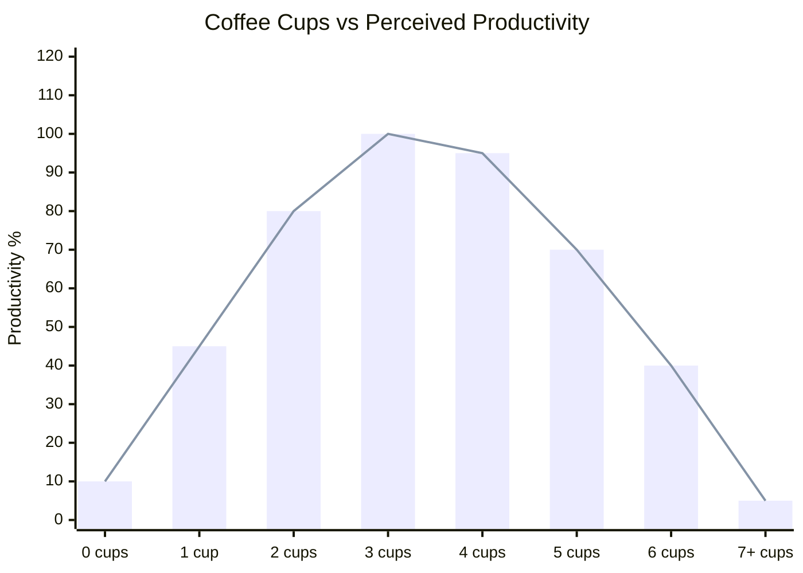

# XY Chart: Coffee Consumption vs Productivity

```mermaid
xychart-beta
    title "Coffee Cups vs Perceived Productivity"
    x-axis ["0 cups", "1 cup", "2 cups", "3 cups", "4 cups", "5 cups", "6 cups", "7+ cups"]
    y-axis "Productivity %" 0 --> 120
    bar [10, 45, 80, 100, 95, 70, 40, 5]
    line [10, 45, 80, 100, 95, 70, 40, 5]
```
