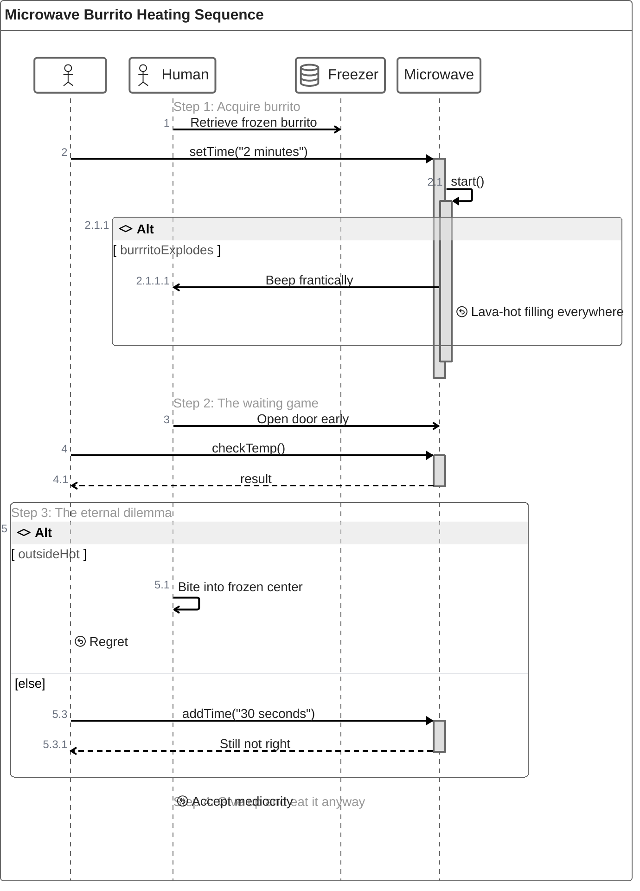

# ZenUML: Microwave Burrito Protocol

```mermaid
zenuml
    title Microwave Burrito Heating Sequence
    @Actor Human
    @Database Freezer

    // Step 1: Acquire burrito
    Human->Freezer: Retrieve frozen burrito

    Microwave.setTime("2 minutes") {
        Microwave.start() {
            if(burrritoExplodes) {
                Microwave->Human: Beep frantically
                return "Lava-hot filling everywhere"
            }
        }
    }

    // Step 2: The waiting game
    Human->Microwave: Open door early
    result = Microwave.checkTemp()

    // Step 3: The eternal dilemma
    if(outsideHot) {
        Human->Human: Bite into frozen center
        return "Regret"
    } else {
        Microwave.addTime("30 seconds") {
            return "Still not right"
        }
    }

    // Step 4: Give up and eat it anyway
    @return
    Human->Human: Accept mediocrity
```
